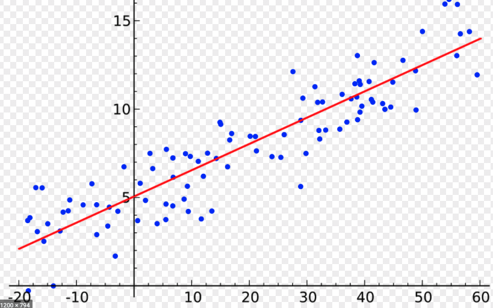

# Linear_Regression

I’ll start to discuss linear regression today by building a simple regression model. In the subsequent blog, We’ll unpack some of the results for a better understanding of what linear regressions are and how we can interpret the data.

Regressions are a way to model the relationship between features of a data set such that one feature is dependent upon one or more other features. For example, we would generally say there is a relationship between a person’s height and their weight, ie, people who are taller will generally weigh more than people who are shorter. Obviously, this is not always the case as you can have people who are very heavy despite being really short and comparatively light.
To examine this further, let look at some weight-height data found in a data set on Kaggle. Let's take a look.

In a python jupyter notebook, we start with some imports that I can use.
